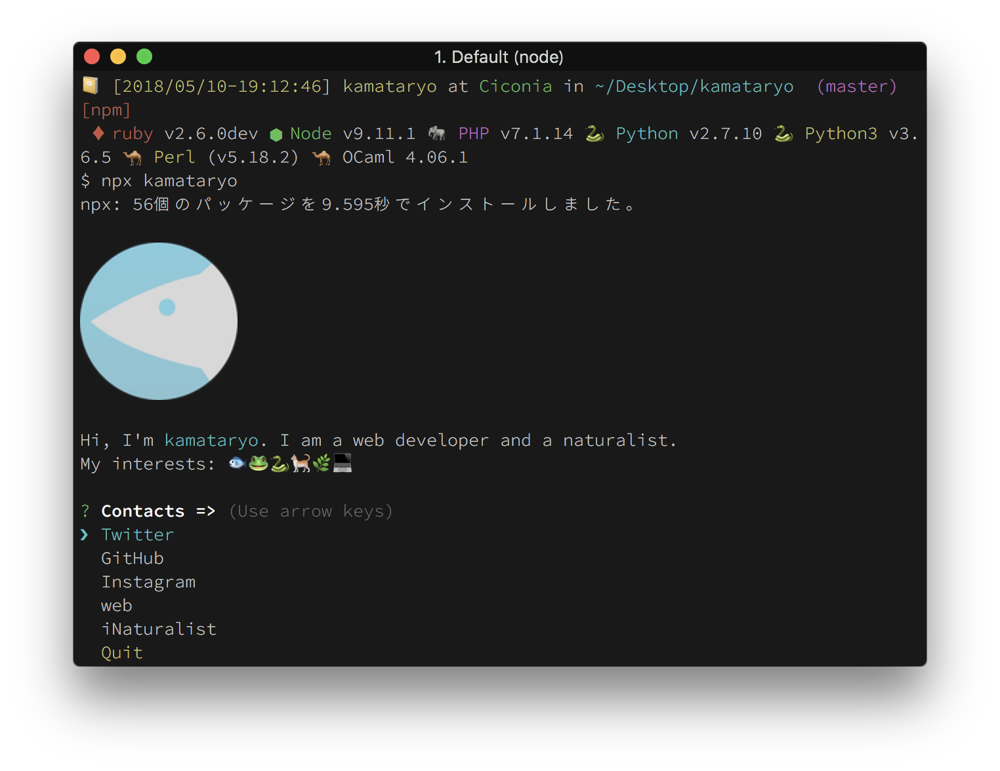

# kamataryo CLI

[](https://travis-ci.org/kamataryo/kamataryo)

```shell
# About me
$ npx kamataryo
# or open my twitter
$ npx kamataryo twitter
```



## development

```shell
$ git clone 
$ cd kamataryo
$ npm install
$ npm test
```
